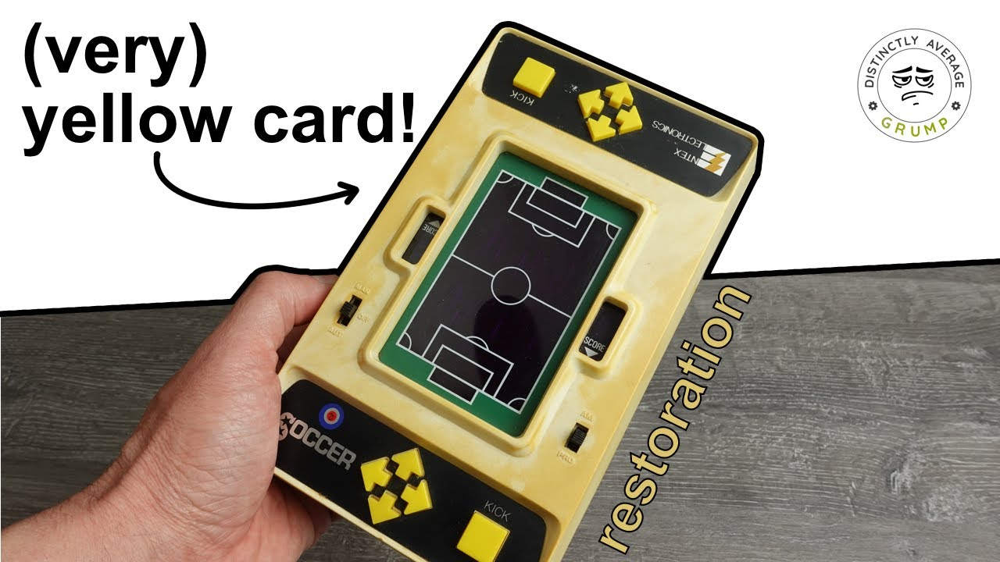

Ich sammle auch alte elektronische Spiele, heute habe ich bei [Zeitzeug](http://zeitzeug.de/) eine mobile Konsole aus dem Jahr 1979 gefunden.
<!--more-->

Das Spiel wurde von der amerikanisch Firma [Entex Industries](https://en.wikipedia.org/wiki/Entex_Industries) hergestellt. Die Firma stellt zuerst Klemmbaustein-Sets her und wechselte später in die Produktion von LCD- und LED-Spielen (wie diesem hier).


[
  {"src": "top.jpg", "alt": "Ansicht von oben"}
]


Die Regeln des Spiels sind recht einfach: Es gibt zwei Spieler, von denen einer jeweils den Ball hat. Eine Runde endet, sobald ein Spieler den Ball verliert oder ein Tor schießt. Die LED des Spielers mit Ballbesitz ist heller. Die Spielerposition lässt sich mit den Pfeilen steuern. Der verteidigende Spieler hat einen zusätzlichen Spieler an der Mittellinie, der nicht steuerbar ist, sondern nur auf und ab wandert. Sobald einer der verteidigenden Spieler die Position des Spielers mit Ballbesitz erreicht, endet die Runde und der Verteidiger wird zum Angreifer.
Wenn ein Spieler vor dem Tor steht, kann er den „Kick“-Knopf drücken. Direkt davor ist jeder Schuss ein Treffer, aber mit mehr Abstand sinkt die Trefferwahrscheinlichkeit. Wenn der Spieler trifft, gibt die Konsole einen Ton ab, die LEDs im Tor blinken drei Mal und der Zähler an der Seite wird erhöht.

Das Spiel ist auch in verschiedenen Sammlungen zu finden:
* Im [Technischen Museum Wien](https://data.tmw.at/object/239617/)
* [Electronic Plastic](https://electronicplastic.com/game/?company=entex&id=245&skip=&filter=&search=display:LED)
* [Handheld Games Museum](https://handheldmuseum.com/Entex/Soccer.htm)

Auf YouTube ist auch ein Video über die Restaurierung einer Konsole zu finden:


    

