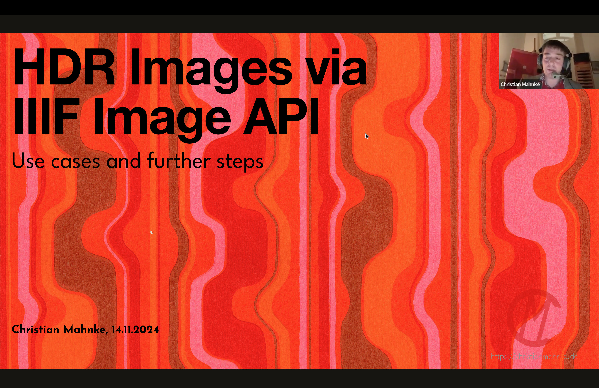

The slides of my presentation on HDR content via IIIF are now available...

<!--more-->

# Slides



# Links to example posts

These posts are part of the demo:

* [HDR Image of a 70s wallpaper](https://christianmahnke.de/en/post/hdr-iiif/)
* [3D model of a milk pourer made of uranium glas](https://christianmahnke.de/en/post/uv-photogrammetry/)
* [Image analysis color enhancement example](https://christianmahnke.de/en/post/hdr-image-analysis/)
* [HDR images for the visualisation of X-ray examinations of old paintings](https://christianmahnke.de/en/post/hdr-radiography-visualisation/)

# GitHub Issue

The mentioned GitHub issue is [IIIF/api#2312](https://github.com/IIIF/api/issues/2312)

# Recording


    


# Update 14.1.2025

There is another article on a potential use case: [Visualisation AI segmentation with HDR](/en/post/visualising-ai-segmentation-with-hdr/)
