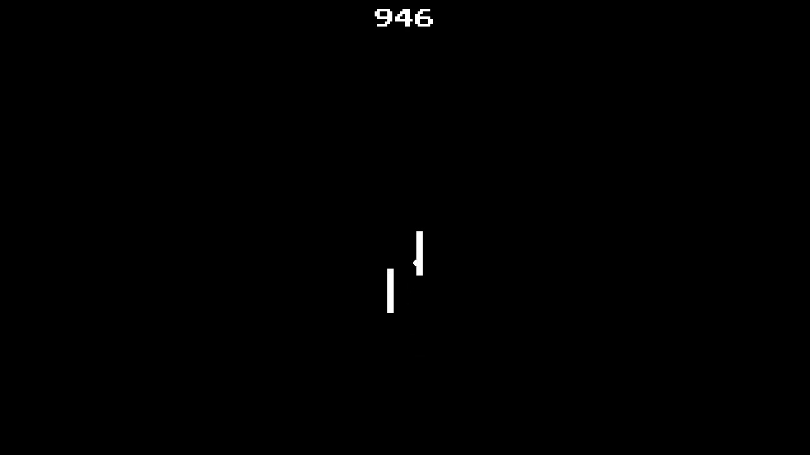

For some reason I came up with the idea of visualising [Pong](https://de.wikipedia.org/wiki/Pong)...
<!--more-->

I have a small collection of old game consoles from before 1980, [many](https://en.wikipedia.org/wiki/List_of_first_generation_home_video_game_consoles) of which are based on the [AY-3-8500 chip](https://en.wikipedia.org/wiki/AY-3-8500). The most famous game made possible by this chip is Pong.

# Research

Now of course you could make countless games, record them, digitise them and then visualise them, but that would take a long time, especially as you would also need two people, as the old systems do not allow a game against the computer. Therefore, a programmable simulation was needed. I came across the following interesting projects and sites during my research:

* [PONG story: Great site about Pong and early consoles](https://www.pong-story.com/)
    * [PONG Story: Pong for the PC](https://www.pong-story.com/pcpong.htm)

* [OdysseyNow](https://pathealy.itch.io/odyssey-now-hal) - Based on Unity

* Pong on the Arduino
    * [70's TV game recreation using an Arduino (Atmel ATmega328/168) processor.](http://searle.x10host.com/AVRPong/index.html) - Extensive documentation for a faithful recreation
    * [Pong for Arduino](https://wolles-elektronikkiste.de/en/pong-for-arduino-computer-table-tennis) - one of many other examples

* JavaScript implementation
    * [Javascript Pong by Jake Gordon](https://codeincomplete.com/games/pong/) - see below

* Other
    * [Pong Consoles Simulation](https://github.com/ThomasVisvader/Pong)

    * [POS (Pong Consoles) CPUs and Other Chips](https://emulation.gametechwiki.com/index.php/POS_(Pong_Consoles)_CPUs_and_Other_Chips) in the [Emulation General Wiki](https://emulation.gametechwiki.com/index.php/Main_Page)

# Implementation

The image was generated on the basis of [`typescript-pong`](https://github.com/adam-s/typescript-pong). This project is a fork (or TypeScript port) of [`javascript-pong`](https://github.com/jakesgordon/javascript-pong). The [documentation](https://codeincomplete.com/articles/javascript-pong/) for the project is very detailed, but the TypeScript variant is easier to customise. Basically, only infrastructural changes, e.g. a non-interactive mode, were necessary.

This required a simple test based on [Playwright](https://playwright.dev/). This allows the recording of the games in the browser and the download of the recording to be automated.

# Post-processing

A few post-processing steps are necessary to generate the image based on the recordings:
* Add video frames together, inspired by [`python-image-averaging`](https://github.com/mexitek/python-image-averaging)
* Separate static and dynamic image parts
* Gamma correction of the dynamic areas to emphasise differences, blur, then colourise
* merge areas again

[OpenCV](https://opencv.org/) and [NumPy](https://numpy.org/) are used for the image operations, [Matplotlib](https://matplotlib.org/) for the colouring.

# Visualisation


[
  {"src": "pong-heatmap1.png", "alt": "Pong Heatmap", "scalePreview": false}
]


In the picture, the static areas are white, as in the game; the coloured areas show how often something happens in which part of the picture.

The distribution follows this scale: On the left (cyan) little activity, on the right (magenta) a lot of activity.

# Statistics

The image consists of 1777136 individual images, or 2:42 hours of gameplay, or 333 rounds.

# Update 9.9.2024

I'm not the only one who has come up with the idea of using Pong for visualisation: [Song Pong](https://victortao.substack.com/p/song-pong).


    

